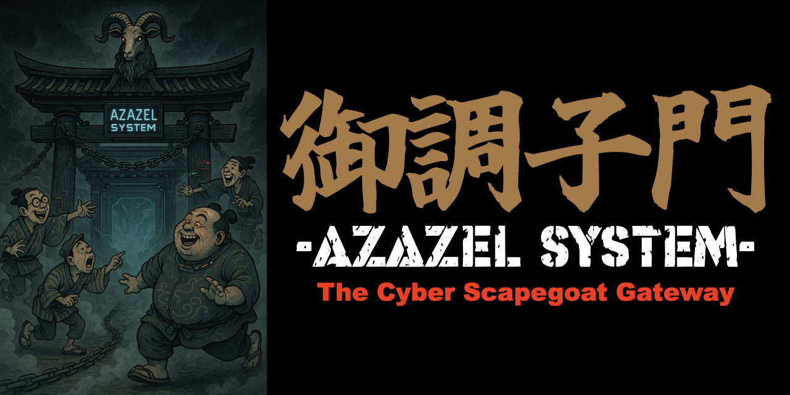

# 御調子門 -AZAZEL system- : The Cyber Scapegoat Gateway

## 概要 / Overview

**Delaying Action（遅滞行動）** という言葉をご存知でしょうか？
これは軍事戦略において、防御部隊が決定的な戦闘を避けつつ、敵の進撃を可能な限り遅らせるために戦い続け、時間を稼ぐための防衛行動を意味します。今日のサイバー戦では、攻撃が高速かつ自動化され、わずか数秒で資産が侵害されるリスクがあります。この古典的な戦術思想を、現代のサイバーセキュリティに再解釈して応用すべきだと私たちは考えました。

この考え方をもとに開発されたのが **御調子門 -Azazel System-** です。本ツールは、**スケープゴート型デコイ**を実装しており、攻撃を吸収し、攻撃者を誤誘導しながら、その進行を戦術的に遅延させます。従来のハニーポットのように単に観察するのではなく、攻撃者を能動的に拘束し、**サイバー空間における遅滞行動**を実現します。

本ツールは、出張先のホテルやイベント会場などの**信頼できない外部ネットワーク**に接続する際や、**一時的なラボ環境**を守る必要がある場面において、ユーザーを能動的に保護する**可搬型のセキュリティゲートウェイ**として設計されています。

現代の戦場はサイバー空間へと移りましたが、「時間を稼ぐために敵を拘束する」という発想は今も通用します。**御調子門**は、サイバー戦における「戦術的足止め」を具現化するための、一つの答えです。

**Azazel System** is a portable active cyber defense tool inspired by the classical military concept of **Delaying Action**—a defensive operation aimed at slowing the enemy's advance while avoiding decisive engagement. In the age of automated and lightning-fast cyber attacks, where assets can be compromised within seconds, we believe this timeless strategy deserves modern re-implementation.

The system uses a **scapegoat-style decoy** to absorb, mislead, and delay adversaries. Unlike traditional honeypots that passively observe, Azazel actively restrains attacker behavior to buy time—a tactical "delaying action" in cyberspace.

This tool is designed for use in **untrusted external environments**—such as hotel Wi-Fi, public venues, or temporary lab setups—where users need portable, proactive protection.

Though the battlefield has shifted into cyberspace, the principle of "binding the enemy to buy time" remains effective. **Azazel System** provides a modern response to that strategic need.

---

## 設計思想 / Design Philosophy

御調子門 -AZAZEL system- の防御思想は、日本における二つの戦術的概念に着想を得ています。

ひとつは、日本陸軍における防御戦術の原則である「**敵を戦場に拘束する**」という考え方です。これは、敵の攻撃をただ防ぐのではなく、あえて戦場に引き留め、敵の行動を制限しながら、味方の後続準備や反撃の時間を稼ぐことを目的としています。御調子門もこれと同様に、侵入者をシステム上に誘導し、デコイや通信遅延の中に拘束することで、攻撃の自由度を奪い、防御側に主導権を渡す構造をとっています。

もうひとつは、日本古来の武術における「**後の先（ごのせん）**」という戦い方です。これは、相手の動きを見てから反応することで、逆に主導権を握るという高度な戦術です。見かけ上は後手に見えても、実際には相手の攻撃を利用して、制御し、反撃の機を得るというものです。御調子門では、Suricataによる侵入検知後に遅滞制御を発動することで、この「後の先」の構えを実装しています。攻撃をあえて引き受け、観察し、制御するという戦術的な対応が、この思想に通じます。

このように、御調子門は「防御とは単に守ることではなく、敵の行動を制御し、時間を稼ぐこと」というコンセプトを体現しており、日本的な戦術思想に根ざしたサイバーデセプションツールです。

**Azazel System** is rooted in two key Japanese strategic doctrines:

- The **Imperial Japanese Army’s principle of battlefield containment**—not simply blocking the enemy, but intentionally binding them to a location to limit their actions and buy time for reinforcements or counteroffensives.

- The **martial arts concept of "Go no Sen"**, or taking initiative in response. Rather than preemptive strikes, this principle capitalizes on the opponent's move, using their momentum against them. Azazel embodies this by activating its response only after intrusion is detected, deliberately reacting to the attacker’s behavior to assert control.

These principles converge in Azazel’s design: **defense is not about passive protection, but about active control and strategic delay.**

---

## 可搬型設計 / Portable Deployment

- **軽量・省電力な構成により、外出先や現場などの一時的なネットワーク接続環境でも容易に導入可能です。**  
*Lightweight and energy-efficient, enabling quick deployment in temporary and mobile environments.*

- **出張時、イベント会場、外部検証ネットワークなど、セキュリティが保証されない場所での利用に最適です。**  
*Perfect for use during business trips, field operations, or in untrusted networks outside your primary infrastructure.*

## 特徴 / Features

- **遅滞戦術の実装 / Tactical Delaying**  
  陸戦における「遅滞行動」の概念を、サイバー空間に適用。侵入を許容しつつ、その進行をコントロール。  
  *Applies the military concept of delaying action to cyberspace—permitting intrusion while strategically controlling its progression.*

- **リアルタイム侵入検知と制御 / Real-Time IDS-based Control**  
  Suricata による侵入検知をトリガーに、攻撃元IPの通信を `tc` や `iptables/nftables` により動的に遅延・制限。  
  *Triggered by Suricata IDS alerts, dynamically throttles or restricts traffic from attacker IPs using `tc` and `iptables/nftables`.*

- **スケープゴート型デコイ / Scapegoat Decoy**  
  OpenCanary等を利用し、攻撃者を観察ではなく誘導・拘束。正規ユーザーには影響を与えずに隔離。  
  *Leverages tools like OpenCanary to mislead and isolate attackers—not merely observe them—without affecting legitimate users.*

- **可搬型設計 / Portable Deployment**
  軽量構成でRaspberry Piに最適化。災害対応や一時的な現場展開にも対応。
  *Lightweight and optimized for Raspberry Pi, enabling easy deployment in disaster recovery or temporary field operations.*

## What's new

  complete with thresholds and notify/storage defaults.
  for each defensive posture.
  and records operator-triggered decisions in `decisions.log`.
  the daemon transitions between portal, shield, and lockdown.
  fields) validated via unit tests.
  `configs/tc/classes.htb`.
  `resolve_allowlist.py` utility that resolves medical FQDNs into CIDRs.
  to ensure release tags remain deployable on clean systems.
  
 - **E-Paper Display Integration** (inspired by Azazel-Zero)  
   Real-time status visualization on Waveshare E-Paper displays showing current
   defensive mode, threat score, network status, and alert counters with boot/shutdown
   animations.

---

## 使用技術 / Stack

- Raspberry Pi OS (64bit Lite)
- Suricata (IDS/IPS)
- OpenCanary (Decoy Services)
- Vector (Log Collection)
- iptables / nftables + tc (Traffic Control)
- Mattermost (Alerting)
- Python + Scapy (Custom Response Logic)
- rsync + SSH (Optional Log Export)

---

## インストール / Installation

### 🔧 必要条件 / Requirements
- Raspberry Pi OS (64bit Lite) などの Debian 系ディストリビューション
- インターネット接続 / Internet connection
- 管理者権限（sudo） / Administrator privileges (sudo)

### クイックセットアップ / Quick setup

最新のリリース、またはこのリポジトリを取得後、ルート権限で `scripts/install_azazel.sh` を実行すると、
必要な依存関係のインストールから Azazel 本体の配置までを一括で行います。

After cloning the repository or unpacking a release bundle, run the installer as root to
provision dependencies and stage the runtime:

```bash
cd Azazel-Pi
sudo scripts/install_azazel.sh
# 必要に応じてサービス起動まで自動化する場合 / start services automatically:
# sudo scripts/install_azazel.sh --start
```

スクリプトは以下を実施します。
- Suricata、Vector、OpenCanary などの主要コンポーネントをインストール
- `/opt/azazel` へコアモジュールとユーティリティを配置
- `/etc/azazel` に設定テンプレートを展開し、`azctl.target` を有効化

サービス起動前に `/etc/azazel/azazel.yaml` を編集し、使用するインターフェース名や QoS プロファイルを
環境に合わせて調整してください。

より詳細な構成手順やチューニング方法は [`docs/setup.md`](docs/setup.md) および
[`docs/OPERATIONS.md`](docs/OPERATIONS.md) を参照してください。

## 運用の流れ / Usage workflow

Azazel を展開した後の代表的な運用タスクは以下のとおりです。

1. `/etc/azazel/azazel.yaml` を編集し、モードごとの遅延・帯域制御値やロックダウン時の許可リストを調整する（テンプレートは `configs/azazel.yaml`）。
2. Suricata の設定テンプレートを環境に合わせてレンダリングしたい場合は `scripts/suricata_generate.py` を使用する。
3. すべての設定が整ったら `sudo systemctl restart azctl.target` で制御プレーンを再読み込みし、`scripts/sanity_check.sh` で主要サービスの稼働状況を確認する。
4. インシデント時は `azctl` 経由でモードを手動切り替えしつつ、`decisions.log` に記録されるスコアリング結果を分析する（詳細は `docs/API_REFERENCE.md`）。

これらのステップにより、Suricata や OpenCanary の検知イベントをトリガーとして、遅滞戦術を段階的に適用できます。


---

## 開発の背景 / Background

現代のサイバー攻撃は高速化・自動化し、従来のハニーポットでは対応が困難です。本システムは、**単なる観察やブロックではなく、戦術的に遅らせる**ことを目的に設計されています。

As cyber attacks become faster and more automated, traditional honeypots fall short. This system embraces a **strategic delaying approach**, turning time into a defensive asset.

---

## メッセージ / Message

> 防御とは、時間を稼ぐことである。  
> Defense is the art of buying time.

---

## 特別謝辞 / Special Thanks

- @k

## ライセンス / License

MIT License

---

## 新しいデプロイフロー / Modern deployment flow

旧来の `1_install_raspap.sh` と `2_install_azazel.sh` は廃止されました。
今後はタグ付きリリースに含まれるインストーラを利用してください。

### Install on Raspberry Pi (clean image)
```bash
# 固定タグを使うこと（例: v1.0.0）
TAG=v1.0.0
curl -fsSL https://github.com/01rabbit/Azazel/releases/download/${TAG}/azazel-installer-${TAG}.tar.gz \
 | tar xz -C /tmp
cd /tmp/azazel-installer && sudo bash scripts/install_azazel.sh
```

ブートストラップ後は `/etc/azazel/azazel.yaml` を編集し、必要に応じて
`docs/OPERATIONS.md` の手順に従って Suricata や OpenCanary を再設定します。
依存パッケージの導入を伴わない従来型の最小ブートストラップは提供されません。

### Documentation
- `docs/ARCHITECTURE.md` — コントロールプレーンの構成図と役割
- `docs/OPERATIONS.md` — タグ付きリリースの取得からローリング更新まで
- `docs/API_REFERENCE.md` — Python モジュールおよびスクリプトの概要
