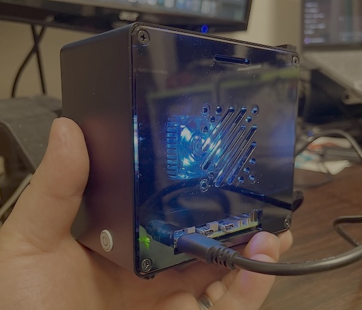

### 開発者向けメモとテスト用ヘルパー API

`TrafficControlEngine` はテストや開発を容易にするためのヘルパーを公開しています。特にネットワーク周りの `tc` / `nft` コマンドを実行する箇所をモックし、root 権限や実際のネットワークスタックに依存せずに単体テストできるようになっています。
- `TrafficControlEngine.set_subprocess_runner(runner_callable)`
   - テストでカスタムのサブプロセスランナーを注入して、`tc`/`nft` の出力を模擬できます。
   - `runner_callable` は `(cmd, **kwargs)` を受け取り、`returncode` / `stdout` / `stderr` 属性を持つオブジェクト（`subprocess.CompletedProcess` が最適）を返すようにしてください。
   - 例（テスト内での利用）:

      ```py
      from azazel_pi.core.enforcer.traffic_control import TrafficControlEngine, make_completed_process
      from tests.utils.fake_subprocess import FakeSubprocess

      fake = FakeSubprocess()
      fake.when("tc qdisc show").then_stdout("")
      fake.when("nft -a add rule").then_stdout("added rule handle 123")

      # クラス属性に注入してインスタンス化すると __init__ 時のセットアップ呼び出しもモックされます
      TrafficControlEngine._subprocess_runner = fake
      engine = TrafficControlEngine(config_path="runtime/test_azazel.yaml")
      try:
            ok = engine.apply_dnat_redirect("10.0.0.5", dest_port=2222)
            assert ok
            rules = engine.get_active_rules()
            assert "10.0.0.5" in rules
      finally:
            # テスト後にクラス属性をクリーンアップ
            try:
                  delattr(TrafficControlEngine, "_subprocess_runner")
            except Exception:
                  pass
      ```

- `make_completed_process(cmd, returncode=0, stdout='', stderr='')`
   - テスト用の `subprocess.CompletedProcess` 相当を簡単に作るためのファクトリ関数です。
   - モジュール (`azazel_pi.core.enforcer.traffic_control`) のトップレベルに公開されています。

これらの API により、root 権限や実行環境に依存しないユニットテストが容易になります。テスト用の軽量ユーティリティ `tests/utils/fake_subprocess.py` も用意しており、単純なコマンド substring マッチングで期待する stdout/stderr を返すことができます。
# AZ-01X Azazel-Pi - The Cyber Scapegoat Gateway

[English](README.md) | 日本語




## コンセプト

**遅滞行動（Delaying Action）** という言葉をご存知でしょうか？軍事戦略において、これは防御部隊が決定的な戦闘を避けつつ、可能な限り敵の進撃を遅らせ、時間を稼ぐための防衛行動を意味します。今日のサイバー戦では、攻撃は高速で自動化されており、資産が数秒で侵害される可能性があります。私たちは、この古典的な戦術概念を現代のサイバーセキュリティに再解釈して適用すべきだと考えています。

この哲学に基づいて開発されたのが **Azazelシステム** です。このツールは、攻撃を吸収し、敵対者を誤誘導し、その進行を戦術的に遅延させる **スケープゴート型デコイ** を実装しています。単に観察するだけの従来のハニーポットとは異なり、Azazelは攻撃者を能動的に拘束し、**サイバー空間における遅滞行動** を実現します。

本システムは、ホテルのWi-Fi、イベント会場、または **一時的なラボ環境** を防御する際など、**信頼できない外部ネットワーク** に接続する際にユーザーを能動的に保護する **ポータブルセキュリティゲートウェイ** として設計されています。

現代の戦場はサイバー空間に移行しましたが、「時間を稼ぐために敵を拘束する」という概念は依然として有効です。**Azazelシステム** は、デジタル戦争における戦術的「サイバー封じ込め」に対する一つの答えを体現しています。

## 設計原理

**Azazelシステム** の防御哲学は、二つの日本の戦術的概念からインスピレーションを得ています：

**戦場拘束**: 旧日本軍の「敵を戦場に釘付けにする」防御原理に基づいています。単に攻撃を阻止するのではなく、意図的に敵対者を制御された環境に引き込み、準備や反撃のための時間を稼ぎながら、その行動の自由を制限するアプローチです。Azazelも同様に、侵入者をデコイや通信遅延に誘導し、攻撃ベクトルを制約して主導権を防御側に移します。

**後の先（ごのせん）**: 「応答において主導権を取る」という高度な武術戦略です。反応的に見えても、この技術は相手の動きを利用して制御を獲得し、反撃の機会を創出します。AzazelはSuricata検知後に遅延制御をトリガーすることで、この哲学を実装し、意図的に攻撃を受け入れ、観察し、制御する—この戦術的対応パターンを体現しています。

このように、Azazelは「防御とは単なる保護ではなく、敵の行動を制御し、時間を稼ぐこと」という概念を実現し、日本の戦略思想に根ざしたサイバー欺瞞ツールです。

## 実装

### ベースプラットフォーム
- **Raspberry Pi 5 Model B**（ポータブルセキュリティゲートウェイ）
- フィールド展開と一時的なネットワーク保護に最適化
- 小規模ネットワーク防御のための低コストソリューション

### Azazel-Zeroとの比較

- **Azazel-Pi**
  - ポータブルセキュリティゲートウェイ（サイバー贖罪の山羊ゲートウェイ）としてRaspberry Pi 5上に構築
  - 一時的に構築された小規模ネットワークに低コスト保護を提供するコンセプトモデルとして設計
  - 強い実験的性質を持ち、複数の技術要素のテストベッドとして機能

- **Azazel-Zero**
  - 軽量版で、使用例を限定し不要な機能を削除することで実世界での運用を意図
  - 機動性と実用性を優先したポータブル物理バリアとして構築
  - コンセプトモデルのAzazel-Piとは異なり、Azazel-Zeroは現場対応可能な実用モデルとして位置づけ

### コア防御機能

#### リアルタイム脅威検知・対応
- **Suricata IDS/IPS**: 侵入検知・防止システム
- **OpenCanary**: 攻撃者誤誘導のためのハニーポットサービス
- **動的トラフィック制御**: 戦術的遅延のための `tc` と `iptables/nftables`

#### 防御モード
- **Portalモード**（緑）: 最小限の制限での通常運用
- **Shieldモード**（黄）: トラフィックシェーピングとQoS制御による強化監視
- **Lockdownモード**（赤）: 厳格なファイアウォールルールと許可リストのみの通信による完全封じ込め

#### ステータス表示・監視
- **E-Paperディスプレイ**: 現在の防御モード、脅威スコア、ネットワーク状態、アラートカウンターを表示するリアルタイムステータス可視化
- **Rich CLIインターフェース**: 色分けされたモード表示器付きターミナルベースステータス監視
- **Webダッシュボード**: アラートと通知のためのMattermost統合

### アーキテクチャコンポーネント

| コンポーネント | 目的 |
|---------------|------|
| `azazel_pi/core/state_machine.py` | 防御姿勢間の遷移を管理 |
| `azazel_pi/core/actions/` | tc/nftables操作を冪等プランとしてモデル化 |
| `azazel_pi/core/ingest/` | Suricata EVEログとOpenCanaryイベントを解析 |
| `azazel_pi/core/display/` | E-Paperステータス可視化とレンダリング |
| `azctl/` | コマンドラインインターフェースとデーモン管理 |
| `configs/` | スキーマ検証付き宣言的設定 |
| `deploy/` | サードパーティサービス展開設定 |
| `scripts/install_azazel.sh` | 自動プロビジョニングとセットアップ |

## 機能

### 戦術的遅延実装
軍事概念の「遅滞行動」をサイバー空間に適用—侵入を許可しながら、トラフィックシェーピングと誤誘導を通じてその進行を戦略的に制御。

### スケープゴートデコイシステム
正規ユーザーに影響を与えることなく、単に観察するのではなく攻撃者を誤誘導し隔離するためにOpenCanaryとカスタムサービスを活用。

### 適応的応答システム
- **Portal → Shield**: トラフィック制御と強化監視を有効化
- **Shield → Lockdown**: 医療FQDN許可リスト付きの厳格なファイアウォールルールを実装
- **動的スコアリング**: 自動モード遷移付き継続的脅威評価

### 内部ネットワークQoS制御 (v2.2.0の新機能)

LANデバイスに対する特権ベースのトラフィックシェーピングとセキュリティ適用：

- **マークベース分類**: HTB帯域シェーピング付きプレミアム、標準、ベストエフォート、制限トラフィッククラス
- **MAC検証**: ARPスプーフィングおよびIP/MAC不一致攻撃を防ぐための3つのセキュリティモード (none/verify/lock)
- **動的優先度**: 適応的帯域割り当てのためのオプションのスコアベース自動クラス調整
- **CSVレジストリ**: IP/MACホワイトリスト付き特権ホストの簡単なCSVベース管理
- **インタラクティブTUI**: 特権ホスト管理とモード切り替えのためのコマンドラインメニュー
- **安全なテスト**: ネットワーク変更なしで設定を検証するDRY_RUNモード

アーキテクチャについては [`docs/INTERNAL_NETWORK_CONTROL.md`](docs/INTERNAL_NETWORK_CONTROL.md)、テストガイドについては [`docs/QOS_TESTING.md`](docs/QOS_TESTING.md) を参照してください。

### ポータブル展開
Raspberry Piに最適化された軽量設定により、災害復旧、フィールド作業、または一時的なネットワークセットアップでの迅速な展開を可能にします。

## 技術スタック

- **ベースOS**: Raspberry Pi OS (64-bit Lite)
- **IDS/IPS**: カスタムルールセット付きSuricata
- **ハニーポット**: サービス欺瞞のためのOpenCanary
- **ログ処理**: 集約ログ収集のためのVector
- **トラフィック制御**: `tc`（Traffic Control）+ `iptables/nftables`
- **アラート**: Mattermost統合
- **ディスプレイ**: Pythonレンダリング付きWaveshare E-Paper
- **言語**: asyncioとrichライブラリ付きPython 3.8+

## インストール

### 要件
- Raspberry Pi 5 Model B（推奨）または互換ARM64デバイス
- Raspberry Pi OS (64-bit Lite) またはDebianベースディストリビューション
- 依存関係インストール用インターネット接続
- 管理者権限（sudoアクセス）
- オプション: ステータス可視化用Waveshare 2.13" E-Paperディスプレイ

### クイックセットアップ

リポジトリをクローンまたはリリースをダウンロードした後、完全自動インストーラーを実行：

```bash
cd Azazel-Pi
# 全依存関係と設定を含む完全インストール
sudo scripts/install_azazel_complete.sh --start

# または段階的インストール:
# 1. 基本インストール
sudo scripts/install_azazel.sh

# 2. 完全設定セットアップ (推奨)
sudo scripts/install_azazel_complete.sh --start

# 3. Ollama AIモデルセットアップ
sudo scripts/setup_ollama_model.sh
```

**完全インストーラー (`install_azazel_complete.sh`) に含まれるもの：**
- 基本依存関係 (Suricata, Vector, OpenCanary, Docker)
- E-Paperディスプレイサポート (Pillow, NumPy)
- PostgreSQLとOllamaコンテナ
- 全設定ファイルの配置
- Nginxリバースプロキシセットアップ
- systemdサービス設定
- Ollamaモデルセットアップ手順

**Ollamaモデルセットアップ：**
インストーラーがAIモデルファイルのダウンロードを促します：
```bash
wget -O /opt/models/Qwen2.5-1.5B-Instruct-uncensored.Q4_K_M.gguf \
  https://huggingface.co/bartowski/Qwen2.5-1.5B-Instruct-GGUF/resolve/main/Qwen2.5-1.5B-Instruct-uncensored.Q4_K_M.gguf
```

または自動モデルセットアップスクリプトを使用：
```bash
sudo scripts/setup_ollama_model.sh
```

完全なインストール手順、トラブルシューティング、E-Paperセットアップについては、[`docs/ja/INSTALLATION.md`](docs/ja/INSTALLATION.md) を参照してください。

### E-Paperディスプレイセットアップ（オプション）

Waveshare E-Paperディスプレイを使用する場合：

```bash
# 完全インストーラーでE-Paper統合を有効化
sudo scripts/install_azazel_complete.sh --enable-epd --start

# ハードウェア未接続でテストしたい場合（エミュレーション）
sudo scripts/install_azazel_complete.sh --enable-epd --epd-emulate --start

# テスト表示（未接続の場合は --emulate 推奨）
sudo python3 -m azazel_pi.core.display.epd_daemon --mode test --emulate

# E-Paperサービスを有効化（--startを使っていない場合）
sudo systemctl enable --now azazel-epd.service
```

完全なE-Paper設定手順については、[`docs/ja/EPD_SETUP.md`](docs/ja/EPD_SETUP.md) を参照してください。

### モジュラーTUIメニューシステム

インタラクティブなターミナルユーザーインターフェース（TUI）メニューは、保守性と拡張性を考慮したモジュラーアーキテクチャを通じて包括的なシステム管理を提供します：

```bash
# TUIメニューを起動
python3 -m azctl.cli menu

# 特定のインターフェース設定で起動
# 例: 実行時のWAN選択を優先します。`--wan-if` を省略した場合、WANマネージャが既定値を選択します。
# 必要に応じて環境変数で上書きできます：
#   export AZAZEL_LAN_IF=${AZAZEL_LAN_IF:-wlan0}
#   export AZAZEL_WAN_IF=${AZAZEL_WAN_IF:-wlan1}
python3 -m azctl.cli menu --lan-if ${AZAZEL_LAN_IF:-wlan0}
```

**モジュラーアーキテクチャ：**

Azazel-Piのメニューシステムは、保守性向上のために機能分離を採用したモジュラー設計を採用しています：

```
azctl/menu/
├── core.py          # メインフレームワーク
├── types.py         # データ型定義
├── defense.py       # 防御制御モジュール
├── services.py      # サービス管理モジュール
├── network.py       # ネットワーク情報モジュール
├── wifi.py          # WiFi管理モジュール
├── monitoring.py    # ログ監視モジュール
├── system.py        # システム情報モジュール
└── emergency.py     # 緊急操作モジュール
```

**主要機能：**
- **モジュラー設計**: 保守性向上のための機能別モジュール
- **Rich UI**: 色分けされたパネル、表、プログレスバー
- **安全性優先**: 危険な操作には多段階確認
- **拡張可能**: モジュールシステムを通じた新機能の簡単な追加
- **リアルタイム監視**: 自動更新付きライブステータス表示

### オプション: Nginx を介して Mattermost を公開

リバースプロキシとして Nginx を利用する場合は、用意済みテンプレートとセットアップスクリプトを使用できます:

```bash
sudo scripts/setup_nginx_mattermost.sh
```

このスクリプトは以下を実行します:
- Nginx のインストール（未導入の場合）
- `deploy/nginx-site.conf` の配置（sites-available へ）
- サイト有効化と Nginx の再起動

適用後は `http://<デバイスIP>/`（80番）で Mattermost に到達できます（裏側は `127.0.0.1:8065` へプロキシ）。
HTTPS を利用する場合は、TLS 用の server ブロックを追加するか Certbot を利用してください。

## 使用方法

### コマンドラインインターフェース

#### ステータス監視
```bash
# 基本ステータス（テキスト出力）
python3 -m azctl.cli status

# スクリプト用JSON出力
python3 -m azctl.cli status --json

# 色分けパネル付きRich TUI
python3 -m azctl.cli status --tui

# 継続監視
python3 -m azctl.cli status --watch --interval 2
```

#### モード管理
```bash
# 長期実行デーモン（自動モード切り替え）
python3 -m azctl.cli serve

# 手動モード遷移
echo '{"mode": "shield"}' | azctl events --config -
echo '{"mode": "lockdown"}' | azctl events --config -
```

#### インタラクティブTUIメニュー

モジュラーTUIメニューは包括的なシステム管理を提供します：

```bash
# モジュラーTUIメニューを起動
python3 -m azctl.cli menu

# カスタムインターフェースを指定
python3 -m azctl.cli menu --lan-if ${AZAZEL_LAN_IF:-wlan0} --wan-if ${AZAZEL_WAN_IF:-wlan1}
```

**メニュー機能：**

1. **コア設定の編集**: `/etc/azazel/azazel.yaml` を修正して遅延値、帯域制御、ロックダウン許可リストを調整（テンプレートは `configs/network/azazel.yaml`）。
    - 既定では `wlan0` を内部LAN（AP）、`wlan1` と `eth0` を外部（WAN/アップリンク）として扱います。`configs/network/azazel.yaml` の `interfaces.external` に `["eth0", "wlan1"]` を定義済みです（必要に応じて変更可能）。
       注: `--wan-if` を指定しない場合、WAN 管理コンポーネントがランタイムで最適な WAN インターフェイスを選択します。明示的に指定したい場合は `AZAZEL_WAN_IF` / `AZAZEL_LAN_IF` を環境変数で設定してください。

2. **Suricataルール生成**: `scripts/suricata_generate.py` を使用して環境固有のIDS設定をレンダリング

3. **サービス再起動**: `sudo systemctl restart azctl-unified.service` で変更を適用

4. **ヘルスチェック**: `scripts/sanity_check.sh` でサービス状態を確認

5. **運用監視**: `decisions.log` のスコアリング結果を分析し、インシデント時に `azctl` で手動モード切り替えを使用

### 防御モード運用

- **Portalモード**: ネットワークへの影響を最小限に抑えたベースライン監視
- **Shieldモード**: 中程度の脅威スコアで有効化；トラフィックシェーピングと強化ログを適用
- **Lockdownモード**: 高重要度アラートでトリガー；医療/緊急FQDN以外の全トラフィックを制限

モード遷移は、タイムスタンプ、スコア、トリガーイベントとともに `/var/log/azazel/decisions.log` に記録されます。

### インタラクティブTUIメニュー

Azazel-Piは完全にモジュール化された包括的なターミナルベースのメニューインターフェースを提供します：

```bash
# TUIメニューを起動
python3 -m azctl.cli menu

# または特定のインターフェースを指定
python3 -m azctl.cli menu --lan-if wlan0 --wan-if wlan1
```

**モジュラーメニューシステム：**

Azazel-Piのメニューシステムは、保守性と拡張性を向上させるために機能別に分離されたモジュラーアーキテクチャを採用しています：

```
azctl/menu/
├── core.py          # メインフレームワーク
├── types.py         # データ型定義
├── defense.py       # 防御制御モジュール
├── services.py      # サービス管理モジュール
├── network.py       # ネットワーク情報モジュール
├── wifi.py          # WiFi管理モジュール
├── monitoring.py    # ログ監視モジュール
├── system.py        # システム情報モジュール
└── emergency.py     # 緊急操作モジュール
```

**メニュー機能：**

1. **防御制御** (`defense.py`)
   - 現在の防御モード表示（Portal/Shield/Lockdown）
   - 手動モード切り替え（緊急時オーバーライド）
   - 決定履歴とスコア変動の確認
   - リアルタイム脅威スコア監視

2. **サービス管理** (`services.py`)
   - Azazelコアサービスの制御（azctl, suricata, opencanary, vector）
   - サービス状態の一覧表示
   - ログファイルのリアルタイム表示
   - サービス再起動とヘルスチェック

3. **ネットワーク情報** (`network.py`)
   - WiFi管理機能の統合
   - インターフェース状態とIP設定
   - アクティブプロファイルとQoS設定
   - ネットワークトラフィック統計

4. **WiFi管理** (`wifi.py`)
   - 近隣WiFiネットワークのスキャン
   - WPA/WPA2ネットワークへの接続
   - 保存済みネットワークの管理
   - 接続状態とシグナル強度表示

5. **ログ監視** (`monitoring.py`)
   - Suricataアラートのリアルタイム監視
   - OpenCanaryハニーポットイベント
   - システムログとデーモンログ
   - セキュリティイベントの要約

6. **システム情報** (`system.py`)
   - CPU、メモリ、ディスク使用率
   - ネットワークインターフェース統計
   - システム温度監視
   - プロセス一覧とリソース使用状況

7. **緊急操作** (`emergency.py`)
   - 緊急ロックダウン（即座にネットワーク封鎖）
   - ネットワーク設定の完全リセット
   - システム状態レポート生成
   - ファクトリーリセット（要確認）

**技術的特徴：**
- **モジュラー設計**: 各機能が独立したモジュールで実装
- **Rich UI**: 色分けされたパネル、表、プログレスバー
- **エラーハンドリング**: 堅牢なエラー処理と回復機能
- **セキュリティ重視**: 危険な操作には多段階確認
- **拡張可能**: 新機能を簡単に追加可能な構造

**安全機能：**
- 危険な操作には確認ダイアログを表示
- root権限が必要な操作の自動検証
- 操作ログの自動記録
- エラーハンドリングと自動回復手順
- 緊急操作には複数回確認が必要

**キーボードナビゲーション：**
- `数字キー`: メニュー項目を選択
- `r`: 画面を更新
- `b`: 前のメニューに戻る
- `q`: 終了
- `Ctrl+C`: いつでも安全に中断可能

### 設定ワークフロー

- [`docs/ja/INSTALLATION.md`](docs/ja/INSTALLATION.md) — 完全インストール・セットアップガイド
- [`docs/ja/OPERATIONS.md`](docs/ja/OPERATIONS.md) — 運用手順とメンテナンス
- [`docs/ja/NETWORK_SETUP.md`](docs/ja/NETWORK_SETUP.md) — ネットワーク設定とゲートウェイセットアップ
- [`docs/ja/TROUBLESHOOTING.md`](docs/ja/TROUBLESHOOTING.md) — 包括的問題解決ガイド
- [`docs/ja/EPD_SETUP.md`](docs/ja/EPD_SETUP.md) — E-Paperディスプレイ設定
- [`docs/ja/ARCHITECTURE.md`](docs/ja/ARCHITECTURE.md) — システムアーキテクチャとコンポーネント関係
- [`docs/ja/API_REFERENCE.md`](docs/ja/API_REFERENCE.md) — Pythonモジュールとスクリプトリファレンス
- [`docs/ja/SURICATA_INSTALLER.md`](docs/ja/SURICATA_INSTALLER.md) — Suricataインストールと設定詳細

#### 動的WAN切り替え（新機能）

- `azctl wan-manager` サービスが `interfaces.external` に列挙されたインターフェースを順番にヘルスチェックし、起動直後と運用中の両方で最も安定した WAN を自動選択します。
- 選定結果と各インターフェースの状態は `runtime/wan_state.json`（本番では `/var/run/azazel/wan_state.json`）に記録され、E-Paper 画面にも「再設定中」「WAN切替完了」といったメッセージで表示されます。テストやカスタム配置では `AZAZEL_WAN_STATE_PATH` 環境変数で状態ファイルの場所を上書きできます。
- WAN マネージャは候補の読み取り順序（優先順位）を持ちます: 明示的な CLI の `--candidate` → `AZAZEL_WAN_CANDIDATES` 環境変数（カンマ区切り）→ `configs/network/azazel.yaml` の `interfaces.external` / `interfaces.wan` → フォールバック。設定ファイルを直接編集せずに候補順序を制御したい環境では `AZAZEL_WAN_CANDIDATES` を利用してください。
- 切り替え時には `bin/azazel-traffic-init.sh`、NAT (`iptables -t nat`) を再適用し、Suricata と `azctl-unified` を順次再起動して即座に新しいインターフェースを利用させます。
- Suricata は `azazel_pi.core.network.suricata_wrapper` を経由して起動するため、サービス再起動だけで常に最新の WAN 状態を参照できます。

開発者向けメモ — 非 root 環境でのテストとフォールバック動作

- WAN マネージャは通常システムのランタイムパス（例: `/var/run/azazel/wan_state.json`）へ状態を書き込みます。systemd 等で root 権限で実行される本番環境ではこれが期待どおりに動作します。
- 一方で開発や CI 環境などでプロセスに `/var/run/azazel` を作成する権限が無い場合、現在の実装は自動的にリポジトリ内の `runtime/wan_state.json` にフォールバックするため、非 root ユーザーでも `azctl wan-manager` を実行して動作確認ができます。
- 明示的に書き込み先を指定したい場合は `AZAZEL_WAN_STATE_PATH` 環境変数を設定してください（開発例）：

```bash
# リポジトリ内の runtime ディレクトリに状態を書き込む（root 不要）
AZAZEL_WAN_STATE_PATH=runtime/wan_state.json python3 -m azctl.cli wan-manager --once
```

- 本番運用では systemd（root）経由で WAN マネージャを動かすことを推奨します。これにより `tc`/`iptables`（または `nft`）やサービス再起動など、特権を要する処理が正しく行われます。例（推奨）:

```bash
sudo systemctl enable --now azazel-wan-manager.service
```

これにより、開発者は権限に縛られずにローカルで動作確認ができ、本番では特権を持った実行で期待どおりの自動適用が行われます。

## 開発の背景

現代のサイバー攻撃はますます高速化・自動化されており、従来のハニーポットでは不十分です。このシステムは **観察やブロックではなく戦術的遅延** を目的として設計されており、時間を防御資産として活用します。

コア哲学は、非対称サイバー戦争において、防御者は多くの場合初期侵害を防ぐことはできないが、攻撃者のその後の行動を制御できるという認識に基づいています。戦略的遅延と誤誘導を実装することで、Azazelは検知、分析、対応の機会を創出します。

## 最新情報

- **E-Paperディスプレイ統合**（Azazel-Zeroからインスピレーション）: 現在の防御モード、脅威スコア、ネットワーク状態、アラートカウンターをブート/シャットダウンアニメーション付きで表示するリアルタイムステータス可視化
- **Rich CLIインターフェース**: 色分けモード表示器とライブ更新付きターミナルベース監視
- **モジュラー設定**: JSONスキーマ検証付き宣言的設定システム
- **ポータブル設計**: フィールド展開と一時的なネットワーク保護に最適化
- **自動プロビジョニング**: 依存関係管理付きシングルスクリプトインストール

## 配備状況

**現在の状況**: **95% 実戦配備可能** 🚀

### ✅ 動作中のコンポーネント
- **トラフィック制御システム**: tc遅延注入（100ms/200ms/300ms）と統合DNAT+QoS
- **脅威検知**: リアルタイムOpenCanaryトラフィック転送を伴うSuricata IDS
- **ネットワークサービス**: WiFi AP（Azazel_Internal）、DHCP/DNS、外部ネットワーク接続
- **コアサービス**: azctl-serve、vectorログ処理、opencanaryハニーポット
- **自動起動**: すべての重要サービスがブート時に自動開始

### 🔧 残存項目
- E-Paperディスプレイ機能（ハードウェア依存、イシューで追跡中）

システムは**フィールド展開可能**であり、自動脅威検知・対応による完全な悪意のあるトラフィック遅延機能を提供します。

## メッセージ

> 防御とは、時間を稼ぐ技術である。
> 
> Defense is the art of buying time.

## ライセンス

MIT License

## 貢献

Azazel-Piプロジェクトへの貢献を歓迎します。[貢献ガイドライン](CONTRIBUTING.md)を参照し、レビュー用のプルリクエストを提出してください。

## セキュリティ開示

セキュリティ関連の問題については、GitHubのプライベート脆弱性報告を使用するか、メンテナーに直接連絡してください。

---

*Azazel-Pi: 戦略的遅延と欺瞞による戦術的サイバー防御*
